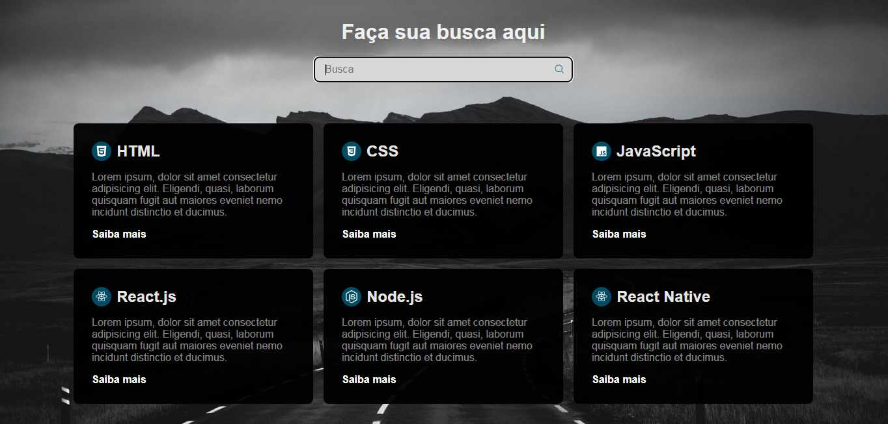

<h1 align="center">Sistema de pesquisas</h1>

  <a href="#-tecnologias">Tecnologias</a>&nbsp;&nbsp;&nbsp;|&nbsp;&nbsp;&nbsp;
  <a href="#-projeto">Projeto</a>&nbsp;&nbsp;&nbsp;|&nbsp;&nbsp;&nbsp;
  <a href="#memo-licença">Licença</a>

 

  

 

  

## 🚀 Tecnologias

Esse projeto foi desenvolvido com as seguintes tecnologias:

- HTML
- CSS
- JavaScript

## 💻 Projeto

Estamos muito acostumados a utilizar sistemas de pesquisa no nosso dia a dia. Mas como criar isso?
Desenvolvi um sistema de filtro para elementos DOM usando JavaScript puro. Um projeto bem simples, mas muito útil.
Desenvolvi esse sistema baseado em um vídeo postado pela rocketseat no [YouTube](https://www.youtube.com/watch?v=p-hgFD2HJSc&t=1310s). Apenas dei uma leve mudada na aparência. 

## 📝 Licença

Esse projeto está sob a licença MIT. Veja o arquivo [LICENSE](./LICENSE) para mais detalhes.

---

by Fernando Rufino :compass:
